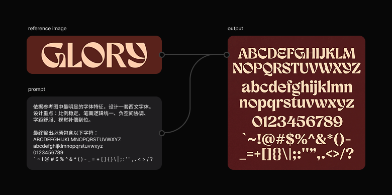
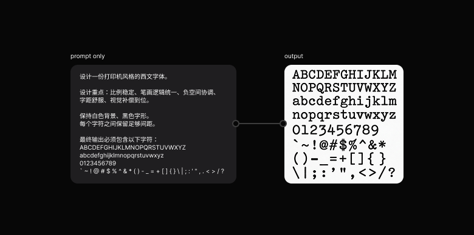
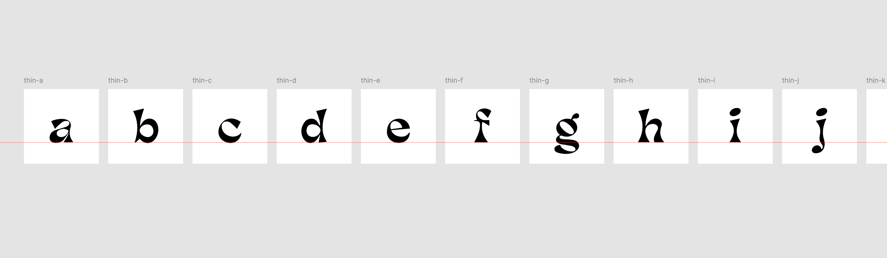
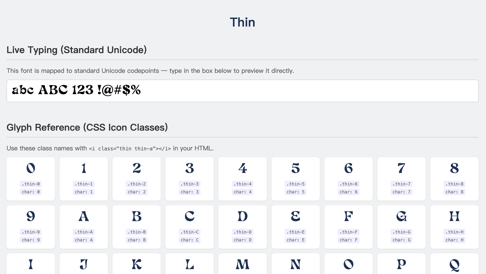

English ｜ [中文](README.zh.md)

# svg-to-font — Agent Skill

An agent-agnostic skill that turns a folder of SVG glyph files into a complete, production-ready font package: **OTF desktop font**, **WOFF2 web font**, **CSS icon classes**, and an **interactive HTML preview page**.

## How to Create Your Own SVG Glyphs

If you don't have SVG glyph files yet, you can use a **text-to-image model** (recommended: Nano Banana Pro / Nano Banana 2) to generate a font image, then process it with design software. Here's the workflow (for Latin/English fonts):

### Step 1 — Generate the Font Design

#### Option A: With a reference font image



Reference image + prompt:

```
Design a western typeface based on the most prominent font characteristics in the reference image.
Design priorities: stable proportions, unified stroke logic, balanced negative space,
comfortable letter spacing, and refined optical compensation.

The final output must include the following characters:
ABCDEFGHIJKLMNOPQRSTUVWXYZ
abcdefghijklmnopqrstuvwxyz
0123456789
` ~ ! @ # $ % ^ & * ( ) - _ = + [ ] { } \ | ; : ' " , . < > / ?
```

#### Option B: No reference image



Describe the style in your prompt:

```
Design a printer-style western typeface.

Design priorities: stable proportions, unified stroke logic, balanced negative space,
comfortable letter spacing, and refined optical compensation.

Keep a white background and black letterforms.
Leave enough spacing between every character.

The final output must include the following characters:
ABCDEFGHIJKLMNOPQRSTUVWXYZ
abcdefghijklmnopqrstuvwxyz
0123456789
` ~ ! @ # $ % ^ & * ( ) - _ = + [ ] { } \ | ; : ' " , . < > / ?
```

> The generated image may have duplicate or missing characters. Regenerate if needed, or make manual adjustments afterward.

### Step 2 — Refine the Glyphs



> Convert the generated image to SVG using a plugin or Adobe Illustrator's **Image Trace → Black and White Logo** option. Import into Figma, merge shapes, align baselines, and name each artboard. Export all artboards as SVG (a full English character set is typically 94 artboards).

### Step 3 — Run the Skill to Generate the Font



## What the Skill Does

Tell your coding agent something like:

- "Make a font from these SVGs"
- "Convert my SVG glyphs into an icon font"
- "Build an OTF and WOFF2 from the files in `./svg`"

The agent will guide you through naming conventions and config, then run the bundled Python scripts to produce:

```
output/
├── fonts/
│   ├── my-font.otf       # Desktop font (CFF cubic bezier)
│   └── my-font.woff2     # Web font (Brotli-compressed)
├── css/
│   └── my-font.css       # @font-face + icon ::before classes
└── my-font.html          # Interactive preview page
```

## Installation

Install this repository into the skill directory or skill manager used by your agent.

### Recommended

Use your agent's skill installer if it supports installing from GitHub.

For Codex, you can ask Codex to use `$skill-installer` to install this repository.

### Manual Install

Clone the repository into your agent's skill search path:

```bash
git clone https://github.com/noiz77/svg-to-font-skill.git <your-agent-skills-dir>/svg-to-font
```

Common examples:

```bash
# Codex
git clone https://github.com/noiz77/svg-to-font-skill.git ~/.codex/skills/svg-to-font

# Claude Code
git clone https://github.com/noiz77/svg-to-font-skill.git ~/.claude/skills/svg-to-font
```

If your agent uses a different directory, replace `<your-agent-skills-dir>` with that path.

Then install the required Python dependencies:

```bash
python3 -m pip install fonttools brotli
```

Restart or reload your agent so it can discover the skill.

## Uninstall

Remove the installed skill folder from the directory where you installed it:

```bash
rm -rf <your-agent-skills-dir>/svg-to-font
```

Common examples:

```bash
# Codex
rm -rf ~/.codex/skills/svg-to-font

# Claude Code
rm -rf ~/.claude/skills/svg-to-font
```

## Requirements

- Python 3.8+
- `fonttools` and `brotli` Python packages
- A coding agent or terminal environment that can run Python scripts

## License

MIT
