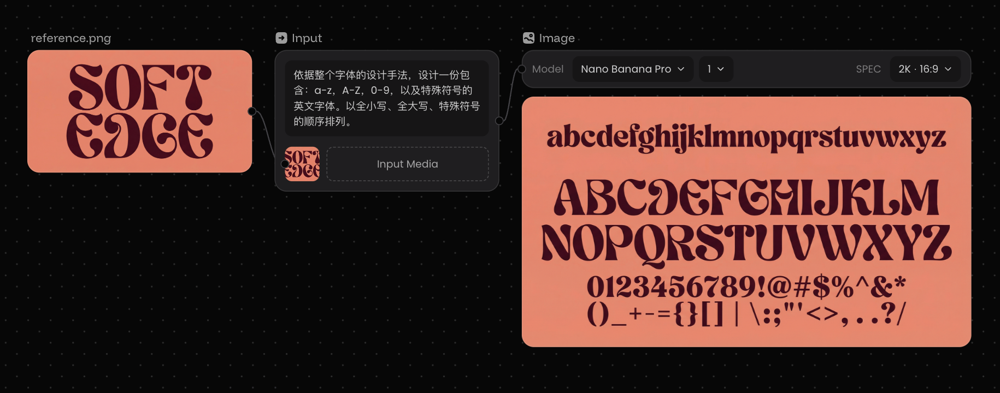
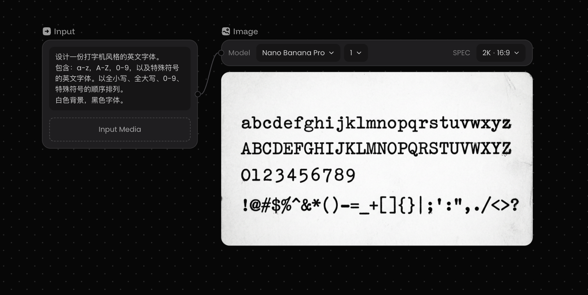
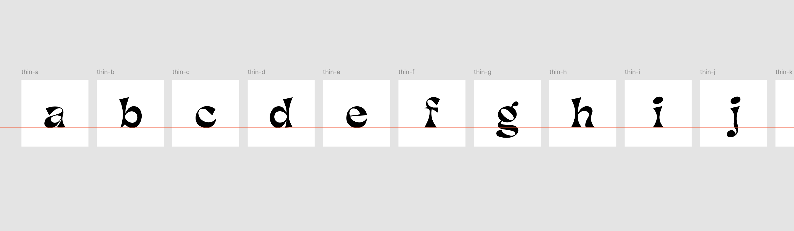
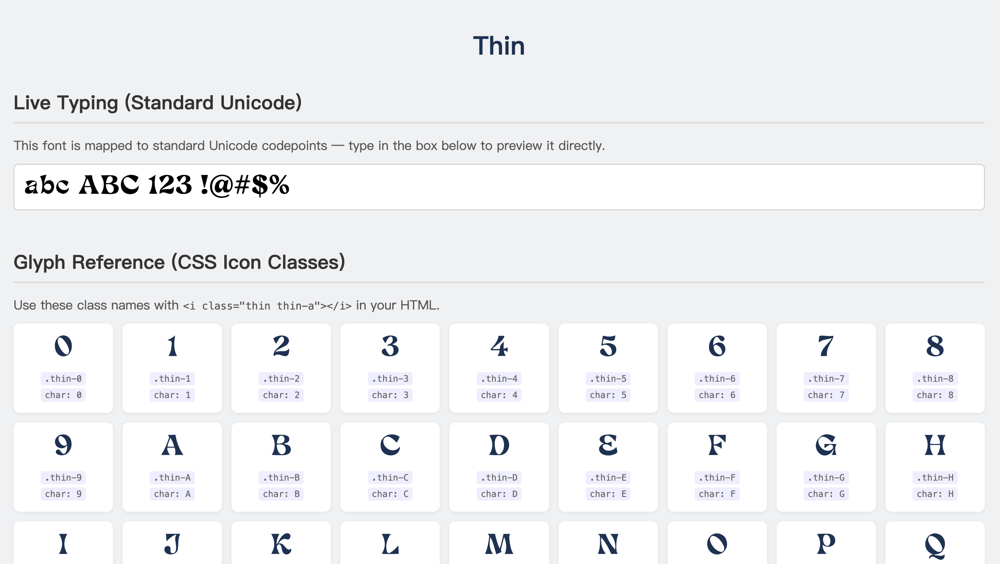

# svg-to-font — Claude Code 技能

一个 Claude Code 技能，将一组 SVG 字形文件转换为完整的、可投入生产的字体包：**OTF 桌面字体**、**WOFF2 网络字体**、**CSS 图标类** 以及**交互式 HTML 预览页面** —— 一条命令全部完成。

## 如何制作自己的 SVG 字体？

如果没有 SVG 字体文件，可以使用**文生图模型**（推荐 Nano Banana Pro / Nano Banana 2）生成一张字体图片，再使用设计软件处理，方法如下（适用英文）：

### Step 1 生成字体设计

#### 方法一：有字体参考图



参考图 + 提示词：

```
依据整个字体的设计手法，设计一份包含：a-z，A-Z，0-9，以及特殊符号的英文字体。以全小写、全大写、特殊符号的顺序排列。
```

#### 方法二：没有字体参考图



提示词描述字体风格：

```
设计一份打字机风格的英文字体。
包含：a-z，A-Z，0-9，以及特殊符号的英文字体。以全小写、全大写、0-9、特殊符号的顺序排列。
白色背景，黑色字体。
```

> 生成的图片可能会存在字母重复或符号丢失，不满意可重新生成或人工后期调整。

### Step 2 调整字体细节



> 将生成的图片使用插件或者 Adobe Illustrator 的「图像临摹 - 黑白徽标」转为 SVG，导入 Figma，做好形状合并 + 排列好字母的基准线 + 画板命名，整理完成后导出为 SVG（以英文为例，一般为 94 个画板）。

### Step 3 使用该 Skill，最终得到字体文件



## SKILL 功能介绍

向 Claude 发出如下指令：

- "用这些 SVG 生成一个字体"
- "把我的 SVG 字形转换成图标字体"
- "从 `./svg` 目录中的文件生成 OTF 和 WOFF2"

Claude 会引导你完成命名规范和配置，然后运行内置的 Python 脚本，生成以下文件：

```
output/
├── fonts/
│   ├── my-font.otf       # 桌面字体（CFF 三次贝塞尔曲线）
│   └── my-font.woff2     # 网络字体（Brotli 压缩）
├── css/
│   └── my-font.css       # @font-face + 图标 ::before 类
└── my-font.html          # 交互式预览页面
```

## 安装

将仓库直接克隆到 Claude 的技能目录：

```bash
git clone https://github.com/noiz77/svg-to-font-skill.git ~/.claude/skills/svg-to-font
```

然后安装所需的 Python 依赖：

```bash
pip install fonttools brotli
```

完成。下次启动 Claude Code 时，该技能会自动激活。

## 卸载

```bash
rm -rf ~/.claude/skills/svg-to-font
```

## 环境要求

- Python 3.8+
- `fonttools` 和 `brotli` Python 包
- Claude Code

## 许可证

MIT
